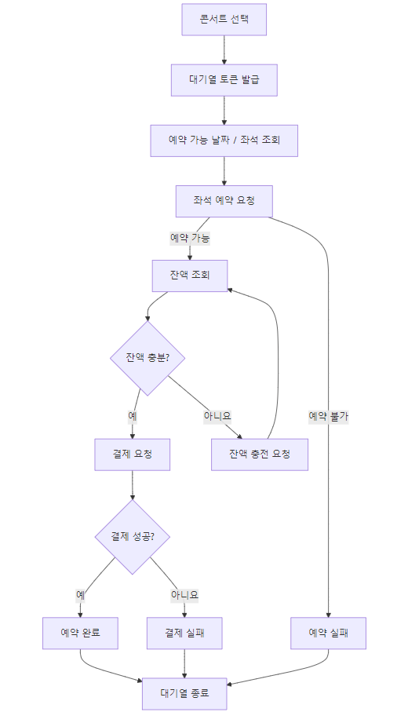
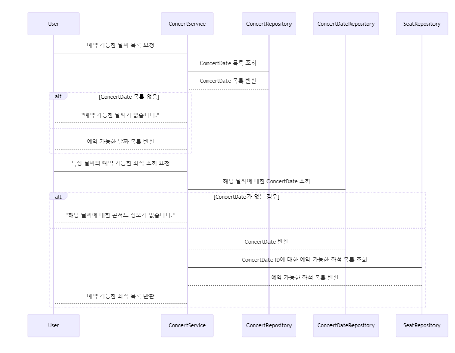
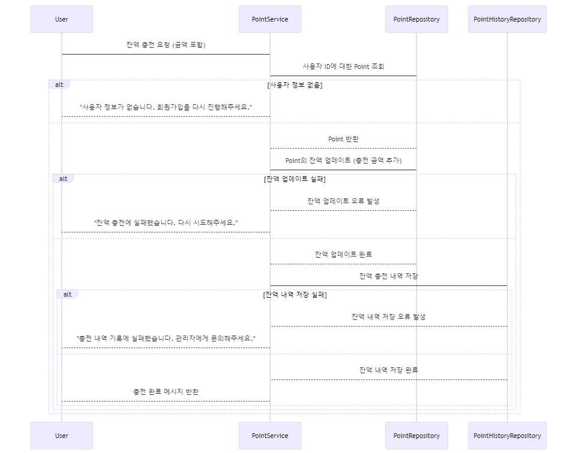
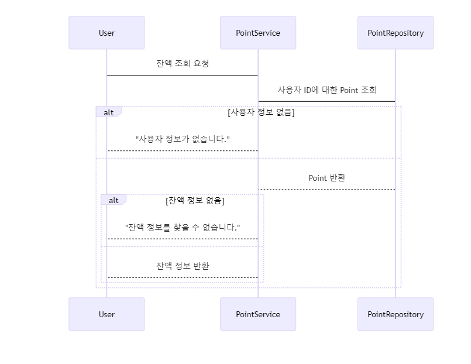
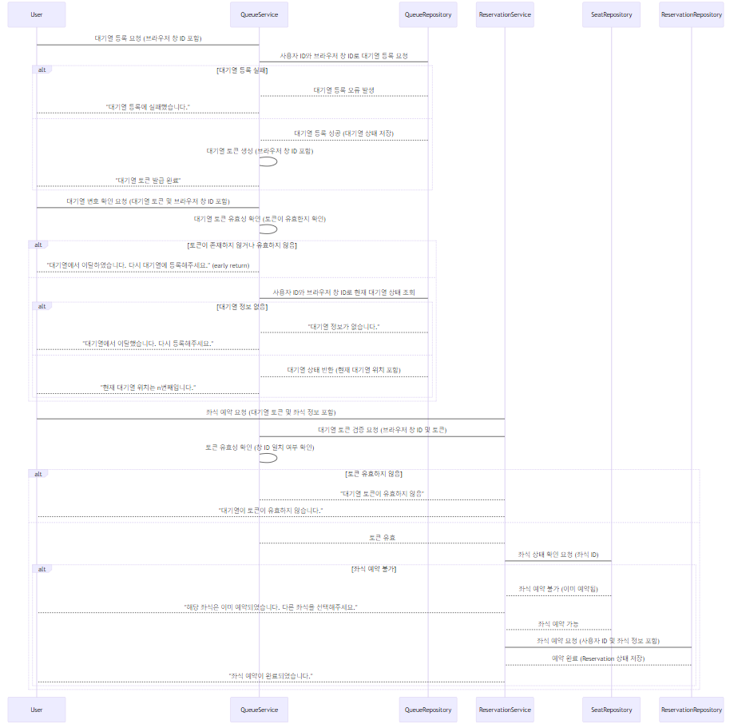
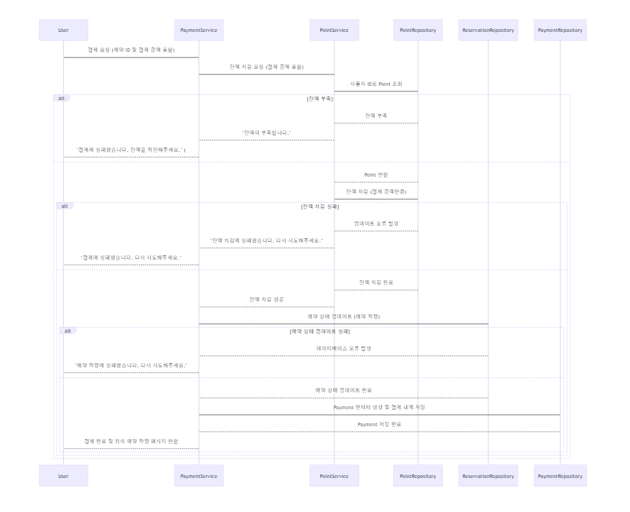

# 콘서트 티켓 예매 서비스

- `콘서트 예약 서비스`를 구현해 봅니다.
- 대기열 시스템을 구축하고, 예약 서비스는 작업가능한 유저만 수행할 수 있도록 해야합니다.
- 사용자는 좌석예약 시에 미리 충전한 잔액을 이용합니다.
- 좌석 예약 요청시에, 결제가 이루어지지 않더라도 일정 시간동안 다른 유저가 해당 좌석에 접근할 수 없도록 합니다.

## 프로젝트 일정

[프로젝트 일정](https://github.com/orgs/hhp-typescript/projects/6)

## 플로우 차트

## 시퀀스

- 예약 가능한 날짜 좌석 조회 API
  

- 포인트 충전 API
  

- 포인트 잔액 조회 API
  
- 대기열 API
  
- 결제 API
  
