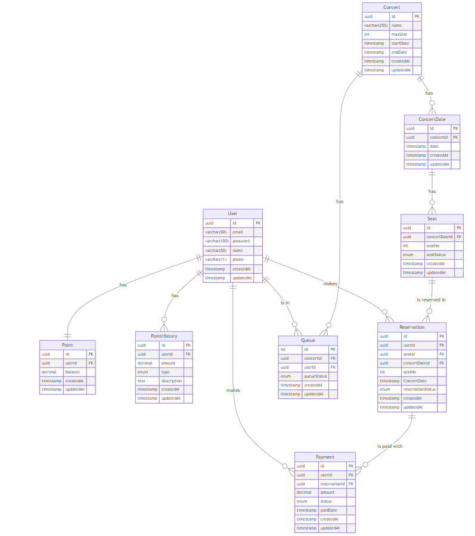

# 콘서트 티켓 예매 서비스

- `콘서트 예약 서비스`를 구현해 봅니다.
- 대기열 시스템을 구축하고, 예약 서비스는 작업가능한 유저만 수행할 수 있도록 해야합니다.
- 사용자는 좌석예약 시에 미리 충전한 잔액을 이용합니다.
- 좌석 예약 요청시에, 결제가 이루어지지 않더라도 일정 시간동안 다른 유저가 해당 좌석에 접근할 수 없도록 합니다.

## 프로젝트 일정

[프로젝트 일정](https://github.com/orgs/hhp-typescript/projects/6)

## API 명세서


## 플로우 차트


## 시퀀스

- 예약 가능한 날짜 좌석 조회 API
  

- 포인트 충전 API
  

- 포인트 잔액 조회 API
  
- 대기열 API
  
- 결제 API
  

## ERD



### Mock API 명세서

#### 1. 유저 토큰 발급 API

- **Endpoint**: `POST /api/v1/users/token`
  - **HTTP Method**: POST
  - **Description**: 사용자 대기열 등록을 위한 토큰 발급
- **Request**:
  - **Headers**:
    - `Content-Type`: `application/json`
  - **Body**:
    ```json
    {
      "userId": "string",
      "browserId": "string"
    }
    ```
- **Response**:
  - **200 OK**:
    ```json
    {
      "token": "string",
      "queuePosition": "integer"
    }
    ```
  - **401 Unauthorized**: 사용자가 인증되지 않음
- **Error**:
  - **400 Bad Request**: 필요한 파라미터 누락
  - **500 Internal Server Error**: 서버 내부 오류 발생
- **Authorization**: 사용자 토큰 (`Bearer token`)

#### 2. 예약 가능 날짜 / 좌석 API

- **Endpoint**: `GET /api/v1/concerts/{concertId}/availability`
  - **HTTP Method**: GET
  - **Description**: 특정 콘서트에 대한 예약 가능한 날짜와 좌석 정보를 조회
- **Request**:
  - **Path Parameters**:
    - `concertId`: 콘서트의 ID
  - **Query Parameters** (optional):
    - `date`: 예약 가능한 날짜 필터링 (`2024-10-11`)
- **Response**:
  - **200 OK**:
    ```json
    {
      "dates": [
        {
          "date": "2024-10-11",
          "availableSeats": [
            {
              "seatNo": "1",
              "status": "available"
            },
            {
              "seatNo": "2",
              "status": "available"
            }
          ]
        }
      ]
    }
    ```
  - **404 Not Found**: 콘서트 ID가 존재하지 않음
- **Error**:
  - **400 Bad Request**: 잘못된 파라미터 형식
  - **500 Internal Server Error**: 서버 내부 오류 발생
- **Authorization**: 사용자 토큰 (`Bearer token`)

#### 3. 좌석 예약 요청 API

- **Endpoint**: `POST /api/v1/concerts/{concertId}/reservations`
  - **HTTP Method**: POST
  - **Description**: 특정 날짜와 좌석에 대한 예약 요청
- **Request**:
  - **Path Parameters**:
    - `concertId`: 콘서트의 ID
  - **Body**:
    ```json
    {
      "date": "2024-10-11",
      "seatNo": "1",
      "userId": "string"
    }
    ```
- **Response**:
  - **201 Created**:
    ```json
    {
      "reservationId": "string",
      "status": "reserved"
    }
    ```
  - **409 Conflict**: 좌석이 이미 예약됨
- **Error**:
  - **400 Bad Request**: 잘못된 요청 데이터
  - **500 Internal Server Error**: 서버 내부 오류 발생
- **Authorization**: 사용자 토큰 (`Bearer token`)

#### 4. 잔액 충전 / 조회 API

- **Endpoint**: `POST /api/v1/users/{userId}/balance` (잔액 충전), `GET /api/v1/users/{userId}/balance` (잔액 조회)
  - **HTTP Method**: POST (충전), GET (조회)
  - **Description**: 사용자 잔액 충전 및 조회
- **Request (잔액 충전)**:
  - **Path Parameters**:
    - `userId`: 사용자 ID
  - **Body**:
    ```json
    {
      "amount": "decimal"
    }
    ```
- **Response**:
  - **200 OK (잔액 충전)**:
    ```json
    {
      "userId": "string",
      "newBalance": "decimal"
    }
    ```
  - **200 OK (잔액 조회)**:
    ```json
    {
      "userId": "string",
      "balance": "decimal"
    }
    ```
- **Error**:
  - **400 Bad Request**: 잘못된 요청 데이터
  - **404 Not Found**: 사용자 ID가 존재하지 않음
  - **500 Internal Server Error**: 서버 내부 오류 발생
- **Authorization**: 사용자 토큰 (`Bearer token`)

#### 5. 결제 API

- **Endpoint**: `POST /api/v1/concerts/{concertId}/payments`
  - **HTTP Method**: POST
  - **Description**: 예약된 좌석에 대해 결제 요청
- **Request**:
  - **Path Parameters**:
    - `concertId`: 콘서트의 ID
  - **Body**:
    ```json
    {
      "reservationId": "string",
      "userId": "string",
      "paymentAmount": "decimal"
    }
    ```
- **Response**:
  - **200 OK**:
    ```json
    {
      "paymentId": "string",
      "status": "paid"
    }
    ```
  - **402 Payment Required**: 잔액이 부족하여 결제 실패
- **Error**:
  - **400 Bad Request**: 잘못된 요청 데이터
  - **404 Not Found**: 예약 ID가 존재하지 않음
  - **500 Internal Server Error**: 서버 내부 오류 발생
- **Authorization**: 사용자 토큰 (`Bearer token`)

## 프로젝트 구조

```
/src
├── /application
│   ├── facade.ts
├── /domain
│   ├── /entities
│   │       └── entity.ts
│   └── /services
│   └── /repositories
│   │       └── repository.interface.ts
├── /infrastructure
│   ├── /mappers
│   │       └── mapper.ts
│   ├── /entities
│   │       └── entity.orm.ts
│   └── /repositories
│   │       └── repository.impl.ts
├── /interfaces
│   ├── /controllers
│   ├── /dto
│   │   ├── /req
│   │   └── /res
└── app.module.ts

```
