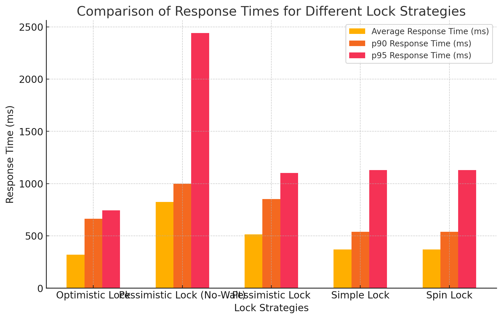

# 동시성 제어 보고서

좌석 예약과 같은 동시성 이슈가 높은 시나리오를 통해 다양한 동시성 제어 전략인 Pessimistic Lock, Optimistic Lock, Simple Lock, Spin Lock을 평가하고 각 전략의 장단점을 분석하였다. 이를 통해 각 동시성 이슈에 적합한 제어 전략을 선택했다.

## 동시성 제어 전략



### 1. Pessimistic Lock

```
비관적 락은 자원을 사용하는 동안 다른 트랜잭션이 접근하지 못하도록 자원에 락을 걸어 안전성을 확보하여, 트랜잭션이 종료될 때까지 자원을 점유하고 대기한다.
```

#### 1 - 1 ) No-Wait 옵션 없이 사용 (no_wait = false)

- 장점
  - 트랜잭션이 완료될 때까지 데이터를 보호해, 다른 트랜잭션이 접근하지 못하도록 보장한다.
- 단점
  - 이 걸린 동안 다른 트랜잭션은 대기해야 하므로, 평균 응답 시간이 증가
  - 비관적 락을 통해 다른 트랜잭션을 대기시키기 때문에 트랜잭션이 증가하면 전체 시스템이 느려질 수 있다.
- 평균 응답 시간: 514.04ms

### 응답시간

#### 1 - 2 ) No-Wait 옵션 사용 (no_wait = true)

```
No-Wait 옵션을 추가하면, 자원이 점유된 경우 대기하지 않고 바로 실패를 반환한다.
```

- 장점
  - 자원 점유 실패 시 즉시 에러를 반환하여 빠르게 다음 요청으로 넘어갈 수 있다.
- 단점
  - 응답시간이 길다.
  - 데드락을 직접적으로 제어하기 힘들다.
- 평균 응답 시간: 822.82ms

### 2. Optimistic Lock

```
낙관적 락은 DB락을 이용하지 않고 버전 관리 방식으로 자원의 일관성을 보장하는 방식이다. 데이터 변경 시마다 버전 번호를 갱신하여 충돌을 감지한다.
```

- 장점
  - 락을 걸지 않으므로 자원 사용 효율이 높다.
- 단점
- 충돌이 발생하면 트랜잭션을 재시도하거나 실패하므로, 동시성 요청이 많을 때 에러가 자주 발생할 수 있다.
- 평균 응답시간: 319.5ms

### 3. Simple Lock

```
심플 락은 최소한의 자원 잠금을 통해 자원 충돌을 방지한다.
```

- 장점
  - 자원 잠금에 따른 대기 시간이 적어 빠른 응답 속도를 유지할 수 있다.
- 단점
  - 자원의 일관성을 충분히 보장하지 않아, 동시성 충돌이 빈번한 환경에서는 신뢰도가 낮을 수 있다.
- 평균 응답 시간: 367.85ms

### 4. Spin Lock

```
스핀 락은 자원에 락이 걸려있을 때 대기하지 않고 짧은 간격으로 자원 접근을 재시도하는 제어방식이다.
```

- 장점
  - 자원 접근을 빠르게 재시도할 수 있어, 응답 속도가 빠르고 단순한 자원 관리가 가능하다.
- 단점
  - 재시도 과정에서 CPU 자원이 과도하게 소모될 수 있으며, 동시성 충돌이 많은 환경에서는 효과가 떨어질 수 있다.

## 동시성 제어 시나리오 분석

### case 1. 좌석예약

```

상황 - 한 좌석의 여러명의 사용자가 동시에 좌석 예약 요청을 하게 될 경우 오버부킹 문제가 생길 수 있다.

발생률 - 높음

해결방법  - 낙관적락을 이용하여 첫번째 이후의 요청들은 모두 실패하게 한다

채택 이유: 첫 번째 예약 요청만 성공하면 되므로 충돌이 발생한 트랜잭션만 실패시키는 낙관적 락을 통해, 자원 점유 시간을 최소화하고 빠른 응답 속도를 유지하고자 선택.
```

### case 2. 포인트 충전

```

상황 - 사용자가 동시에 여러번 충전 요청을 하게 될 경우 충전이 누락되는 문제가 발생할 수 있다.

발생률 - 낮음

해결방법  - 비관적을 이용하여 모든 충전 요청이 진행되게 한다.

채택 이유: 포인트 충전은 정확한 금액의 누락 없는 처리가 중요하므로, 동시성 충돌 시에도 모든 요청이 처리되도록 비관적 락을 선택.
```

### case 3. 결제

```

상황 - 사용자가 동시에 여러번 결제 요청을 하게 될 여러번 결제하게 될 가능성이 있다.

발생률 - 낮음

해결방법  - 낙관적락을 이용하여 첫번째 이후의 요청들은 모두 실패하게 한다.

채택 이유: 결제는 첫 번째 성공 요청만을 허용하면 되므로, 자원 점유를 최소화하고 빠른 응답을 제공하는 낙관적 락을 선택.
```
